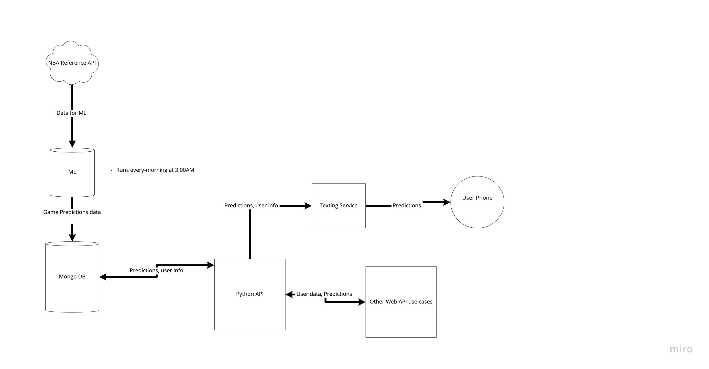

# the-lazy-sports-gambler

private repo to store the lazy sports gamblers source code 


## Draft of prototype architecture 




## Dockerfiles 
### NBA_ML_BETS_API commands:
* Build image
```yaml
docker build -t nba_ml_bets_api:latest .
```
* run container
```yaml
docker run -d -p 5000:5000 nba_ml_bets_api
```
### Machine Learning commands:
* Build image
```yaml
docker build -t machine_learning:latest .
```
* run container
```yaml
docker run -d -p 5000:5000 machine_learning
```
### Text Service commands:
* Build image
```yaml
docker build -t text_service:latest .
```
* run container
```yaml
docker run -d -p 5000:5000 text_service
```
BOT Token =OTE3MTg1NzMzMjEzNjkxOTE1.Ya1Bxw.hNX-KOYZu2AcTv1wJMxUHy7Mkg0

https://discord.com/api/oauth2/authorize?client_id=917177302566182932&permissions=519232&scope=bot